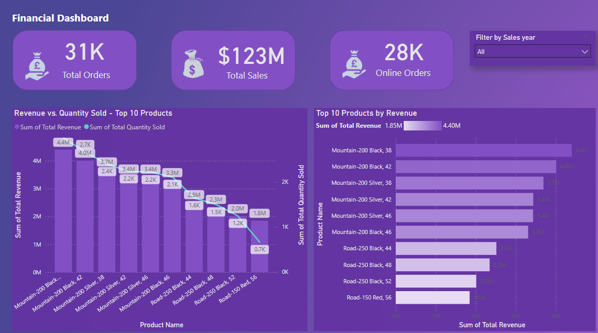

# 🧾 Sales Performance Analysis & Customer Segmentation

This project analyzes company sales performance and customer behavior using **SQL Server** and **Power BI**. It is designed to provide insights into regional sales trends, product performance, and customer segmentation to inform data-driven marketing and sales strategies.

## 📊 Tools Used

- **SQL Server**: Data cleaning, transformation, and aggregations.
- **Power BI**: Data modeling, DAX calculations, interactive dashboard creation.

## 📁 Folder Structure

- `measures.dax` – DAX measures used in the Power BI dashboard.
- `Sales_Performance_Report.pbix` – Power BI report file.
- `dashboard1.png` – Preview image of the dashboard.

## 📌 Key Business Questions Answered

- Which regions generate the most revenue?
- What are the top-selling products by category?
- How does customer purchase frequency vary by segment?
- Which channels drive the most sales conversions?

## 🗂️ Database Tables

- `Customers`
- `Orders`
- `Products`
- `Regions`
- `Sales_Channels`
- `Date_Dim`

## 🧠 DAX Measures

- `Total Sales`
- `Profit Margin`
- `Customer Count`
- `Sales by Region`
- `Monthly Sales Trend`
- `Repeat Customer Rate`

See [`dax/measures.dax`](measures.dax) for the full list of measures.

## 📈 Dashboard Preview

## 🚀 How to Run

1. Run `data/sales_database.sql` in SQL Server to set up the database.
2. Open the `.pbix` file in Power BI Desktop.
3. Connect to the SQL Server database.
4. Refresh the data model and view the dashboard.

## 📬 Contact

For any questions, reach out via [LinkedIn](https://www.linkedin.com/in/timelesshov) or email me at stanley.chinor@gmail.com.
